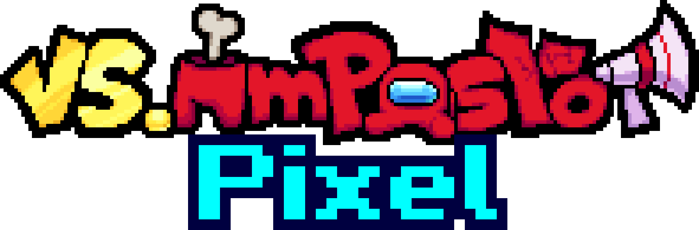

    
    <h1>VS IMPOSTOR Pixel</h1> <!-- this is just here so the table of contents thing shows stuff properly (???) -->
    
<b>Created by <a href="https://github.com/kenton54">kenton</a></b>

     
    

        <b>VS IMPOSTOR Pixel</b> is a <a href="https://ninja-muffin24.itch.io/funkin">Friday Night Funkin'</a> Modification based on the mod <a href="https://vsimpostor.com">VS IMPOSTOR</a> created by the team IMPOSTORM, which itself is based of the very popular game and cultural meme <a href="https://www.innersloth.com/games/among-us">Among Us</a> made by <a href="https://www.innersloth.com">Innersloth</a>.
    

     
    

        This is an unnoficial sequel, meant to not only improve what's already been introduced to the table, but to expand on it as well. Expect this mod to be nearly double (or above, idk yet im writing this before 1.0 LOL) the size of the original <a href="https://vsimpostor.com">VS IMPOSTOR</a>.
    

     
    

        The mod is meant to be played with <a href="https://codename-engine.com">Codename Engine</a> (Version 1.0.2). The mod is fully compatible with Desktop and Mobile devices!
    

     
    

        Downloads
         
        <b>
        <a href="https://gamebanana.com/mods/506768">Gamebana</a>
        &middot;
        <a href="https://drive.google.com/drive/folders/1D7bzf95Ig0HuAl6Zrm4iikSvv_Mc0cSm?usp=sharing">Google Drive</a>
        </b>
    

<h1 align="center">THE STORY</h1>
After beating Black (in the song Finale of VS IMPOSTOR v4), he doesn't want to admit defeat, so he pulls up one last trick and reset the timeline, erasing all memories and pixelating everything in the process, now Boyfriend, back where his journey in the Among Us universe started, has to reencounter all the impostors and crewmates once again, plus some new faces that won't make his time around much easier!

<h1 align="center">TERMS OF USAGE</h1>
You're allowed to use all assets <b>THAT ARE MADE BY ME</b>, more specificly; art, animations and the code, just make sure to credit me. However with the music, you'll have to reach out to the original authors and ask them for permission (don't ask me to do that for you). If you fail to follow these simple steps then prepare to meet me and my lawyers in the courtroom :)

###### I'm just kidding, I'm not Nintendo LOL. But please make sure to credit the original authors, they put a lot of work in what they do.

<!-- I feel like the nintendo ninjas will come right at me at any moment...... COME FIGHT MEE IM NOT SCARED >:)))))))) *gets annihilated by a fine of 100000000000000000 dollars* -->

This doesn't apply if you just want to showcase the mod, just stuff (that isn't in the mod) that uses the mod's assets.

<h1 align="center">THE TEAM BEHIND THE MOD</h1>

## Director and Programmer
- [kenton](https://github.com/kenton54)

## Artists, Pixel-Artists and Animators
- [kenton](https://github.com/kenton54)
- GTM

## Musicians
<table>
    <tr>
        <th>Musician</th>
        <th>Amount Composed</th>
    </tr>
    <tr>
        <th><a href="https://www.youtube.com/@SparklyYea">Sparkly</th>
        <th>4</th>
    </tr>
    <tr>
        <th><a href="https://www.youtube.com/@SilteTheMusician">Silte</th>
        <th>1</th>
    </tr>
</table>

## Charters
<table>
    <tr>
        <th>Charter</th>
        <th>Amount Charted</th>
    </tr>
    <tr>
        <th><a href="https://github.com/kenton54">kenton</th>
        <th>17</th>
    </tr>
    <tr>
        <th>Kdead</th>
        <th>4</th>
    </tr>
</table>

## Translators
<table>
    <tr>
        <th>Translator</th>
        <th>Language</th>
    </tr>
    <tr>
        <th><a href="https://github.com/kenton54">kenton</th>
        <th>Spanish</th>
    </tr>
    <tr>
        <th>Moxt</th>
        <th>French</th>
    </tr>
    <tr>
        <th>mikeyguy</th>
        <th>Portuguese</th>
    </tr>
    <tr>
        <th>Fred</th>
        <th>Russian</th>
    </tr>
    <tr>
        <th>Video Fanmade Guy</th>
        <th>German</th>
    </tr>
    <tr>
        <th>Huy1234TH</th>
        <th>Vietnamese</th>
    </tr>
</table>
